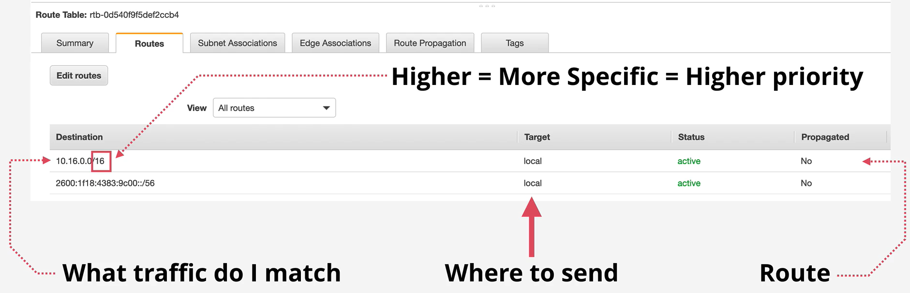
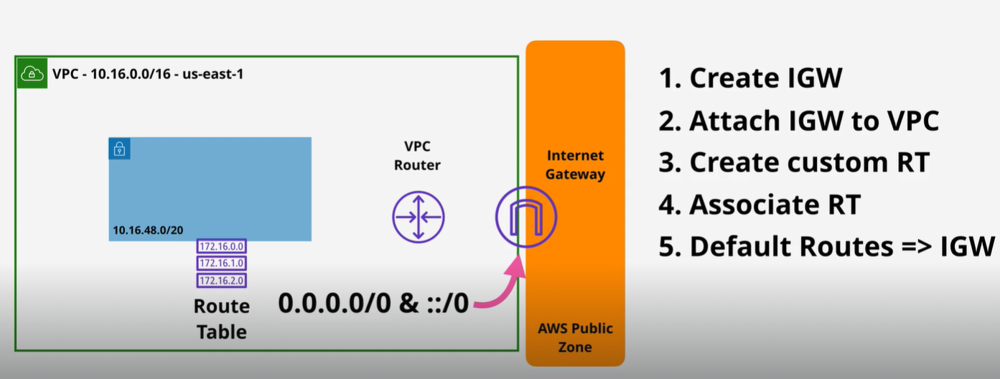
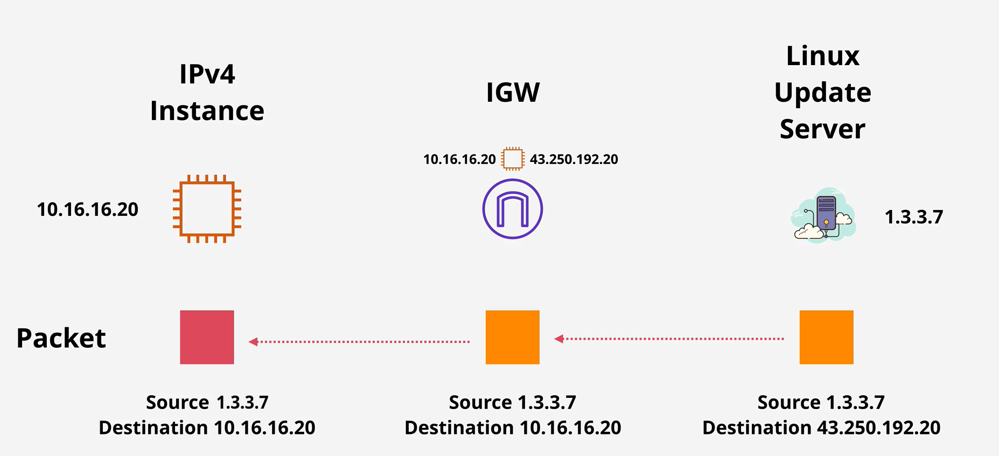
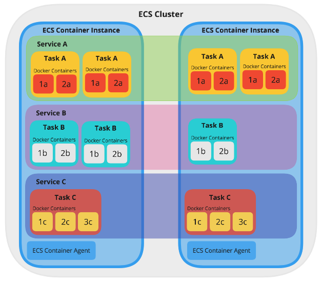
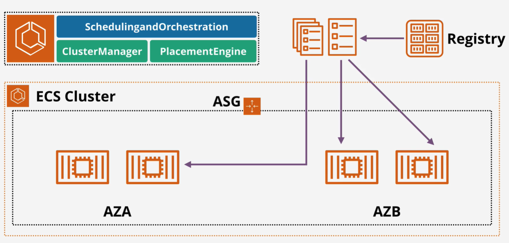
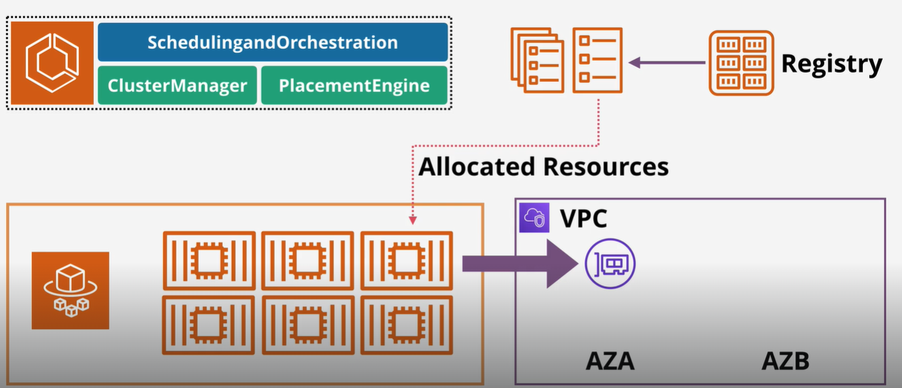
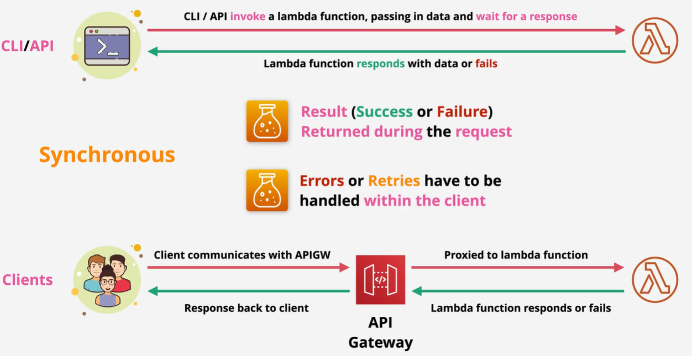
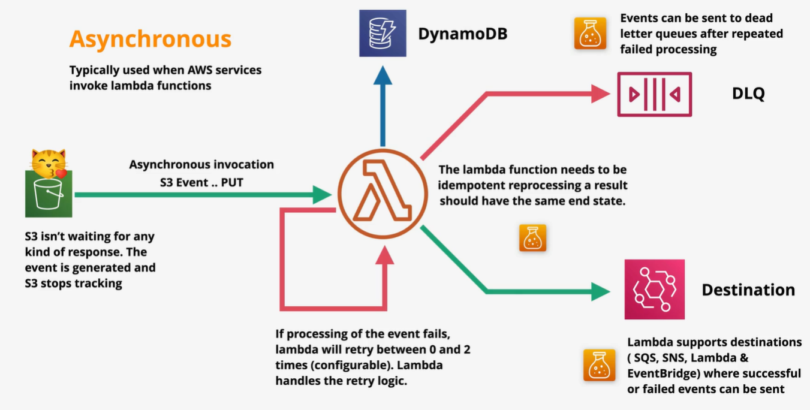
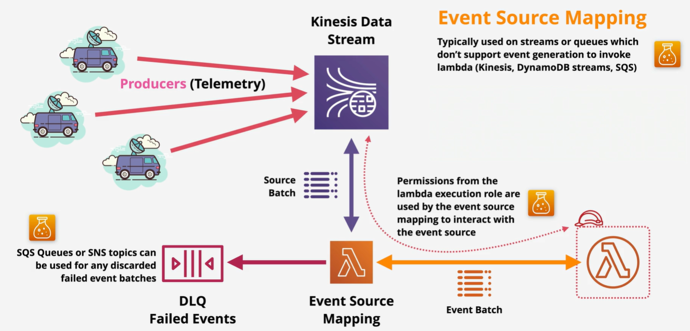

# AWS knowledge
## IAM
### User

  
Summary

   
  
  + There's the 5000 IAM user limit per account.

### Group

  
Summary

   
  
  + Group are not a true identity.
  + Group just container which contains Users.
  + A resource policy cannot grant acess to an group.

### Role

  
Summary

   

  + Can't log in to a Role.
  + Role has two types of policy which can be attach: _Trust Policy_ and _Permissions Policy_.

## Organization
### Service Control Policies

  
Summary

   
  
  + Service Control Policies (SCPs) are just a boundary. They define the limit of what is and isn't allowed
  + The management account is special and it's unaffected by any service control policies.
  + They don't grant any permissions.
  + The default of SCPs is FullAWSAccess.

## CloudTrail

  
Summary

   
  
  + Enable by default on AWS account, but it's only the 90-day event history.
  + Don't get any storage in S3 unless configure a trail.
  + Store management events only by default.
  + IAM, STS, CloudFront log their data as global service events at US East 1 and trail will need to be enable to capure that data.
  + Not real-time.

## Amazon Elastic Compute Cloud (EC2)

  
What is AWS EC2

   
  

## Amazon Virtual Private Cloud (VPC)

  
What is AWS VPC

   
  
  Amazon Virtual Private Cloud (VPC) is a service that allows you to create a logically isolated network within the AWS cloud. 

### Sizing and Structure

  
What is VPC CIDR

   

  A VPC CIDR (Virtual Private Cloud Classless Inter-Domain Routing) block is a range of IP addresses assigned to your VPC in AWS. For example, a CIDR block of `10.0.0.0/16` includes all IP addresses from `10.0.0.0` to `10.0.255.255`.
   

### VPC Subnets

  
What is VPC Subnet?

   

  A subnet in Amazon VPC is a range of IP addresses within your VPC. It's created within one availablity zone (AZ) and it can nerver be changed. 

  _Public and Private Subnets:_
  + **Public Subnets:** These subnets have a route to the internet through an Internet Gateway (IGW). Instances in a public subnet can communicate directly with the internet.
  + **Private Subnets:** These subnets do not have a direct route to the internet. Instances in a private subnet can access the internet through a NAT Gateway or NAT Instance.

  _Subnet and AZ:_

  + One subnet is created in a specific AZ, and a subnet can never be in multiple availability zones.
  + One AZ can have zero or many subnets.

  Subnets can communicate with orther subnets in the VPC.
  

  
Subnet IP Addressing

   

  There are 5 IPs adress within every VPC subnet that you can't use:
  + Network adress (`10.16.16.0`)
  + Network + 1 (`10.16.16.1`) - VPC Router
  + Network + 2 (`10.16.16.2`) - Reserved (DNS*)
  + Network + 3 (`10.16.16.3`) - Reserved Future Use
  + Broadcast Adress (`10.16.31.255`) - Last IP in Subnet
  

### Routing, Internet Gateway & Bastion Hosts

  
VPC Router

   

  VPC router is a highly available device which is present in every VPC (default or custom), which moves traffic from somewhere to somewhere else. It runs in all of the availability zones that the VPC uses. The router has a network in every subnet (_Network + 1_).
  

  
Route Table

   

  The route table associate with a subnet defines what the VPC router will do when data leaves that subnet. Each subnet in your VPC must be associated with a route table, which controls the routing for that subnet. 

  

  **Route Table terminology:**

  + **Routes:** Each route in a table specifies a destination and a target. The destination specifies the range of IP addresses (CIDR block) that the route applies to, and the target is where you want the traffic to go. For example, to enable internet access, you might have a route with a destination of 0.0.0.0/0 (all IPv4 addresses) and a target of an internet gateway.
  + **Main Route Table:** When you create a VPC, AWS automatically creates a main route table.
  + **Subnet Route Tables:** Each subnet in your VPC must be associated with a route table. If you don’t explicitly associate a subnet with a route table, it uses the main route table by default. You can create custom route tables and associate them with specific subnets.
  + **Local Route:** Every route table contains a `local` route for communication within the VPC. This route is automatically added and cannot be removed.
  + **Route Priority:** If there are multiple routes that match the destination IP address, the most specific route (longest prefix match) is used. For example, a route for `10.0.0.0/24` will take precedence over a route for `10.0.0.0/161`. (`10.0.0.0/24` > `10.0.0.0/161`)
  + **Static and Propagated Routes:** Routes can be static (manually added) or propagated (automatically added by AWS services like VPN connections). Static routes take priority over propagated routes if they have the same destination
  

  
Internet Gateway (IGW)

   

  Internet Gateway enables resources in your VPC, such as EC2 instances, to connect to the internet if they have a public IP address. It also allows resources on the internet to initiate connections to your VPC resources using their public IP addresses. One Internet Gateway will cover all of the AZs in the region. This is one-to-one relationship between Internet Gateway and VPC.

  + One VPC can have zero or one IGW.
  + IGW can created and not attach to a VPC, so it can zero or one VPC.

  
  

  
IPv4 Addresses with IGW

   

  

  The EC2 instacnce (IPv4 instance) can not aware its public IP. It just have a private IP.
  

### NAT
### Security Group

## Amazon Elastic Kubernetes Service (EKS)

  
What is AWS EKS

   

  Amazon Elastic Kubernetes Service (Amazon EKS) is a managed Kubernetes service that makes it easy for you to run Kubernetes on AWS and on-premises.

## Amazon Elastic Container Service (ECS)

  
What is AWS ECS

   

  ECS is the AWS Docker container service that handles the orchestration and provisioning of Docker containers.
 
  

  
ECS terminology

   

  + **Task Definition -** A blueprint that describes how a Docker container should launch. It contains settings like exposed port, docker image, cpu shares, memory requirement, command to run and environmental variables.
  + **Task -** It can be thought of as an “instance” of a _**Task Definition**_. A task can include one or more _containers_.
  + **Container Definition -** A task definition is essentially a blueprint for your application. It describes how one or more containers should be launched within a cluster
  + **Service -** A service manage the lifecycle of tasks, ensuring that the desired number of tasks are always running. It brings resilience and scalability to our tasks.
  + **Cluster -** A logic group of _**EC2**_ instances. _(fagate or ec2 mode)_
  + **Container Instance -** This is just an _**EC2**_ instance that is part of an _**ECS Cluster**_ and has docker and the ecs-agent running on it.
  
  

  
Task vs Service

   
  
  **Task:**
  + A Task is created when you run a Task directly, which launches container(s) (defined in the task definition) until they are stopped or exit.
  + Running Tasks directly is ideal for short-running jobs. For example: `cron` task.

  **Sevice:**
  + A Service is used to guarantee that you always have some number of Tasks _running at all times_. If a Task fails, the Service scheduler will automatically launch a new instance to replace it.
  + A Service configuration references a Task definition. A Service is responsible for creating Tasks.
  + A Service configuration _references_ a Task definition. A Service is responsible for _creating_ Tasks.

  _Example:_ 

  If I deployed my website powered by Node.JS in Oregon (us-west-2) I would want say at least three Tasks running across the three Availability Zones (AZ) for the sake of High-Availability; if one fails I have another two and the failed one will be replaced. **Creating a Service is the way to do this**.

### Cluster

  
EC2 Mode

   

  

  With EC2 mode, ECS cluster is created within a VPC inside you AWS account. EC2 instances are used to run containers. When you create the cluster you specify an initial size which controls the number EC2 insatances. And you need to worry about capacity and availability for you cluster. So if you want to use containers in your infastructure but you absolutelt need to manage the container host capacity and availability then EC2 mode is for you.

  
Fargate Mode

   

  

  + Serverless: Fargate is a serverless compute engine, which means that AWS manages the underlying infrastructure for you. This allows you to focus on building and running your applications without having to worry about managing servers.

  
Fargate vs EC2 Mode

   
  
  **When to use EC2:**
  + When you have existing EC2 hardware that you want to leverage.
  + When you need more control over the underlying instances, such as choosing specific instance types or optimizing for network or GPU performance.
  + For complex microservices architectures.
  + If you have specific compliance or security requirements.

  **When to use Fargate:**
  + If you prefer not to manage the underlying infrastructure and want AWS to handle it.
  + Application with unpredictable or variable workloads, as it can scale up and down automatically.
  + When you need to deploy quickly without worrying about the infrastructure setup.
  + Suitable for short-lived tasks.

  
EC2 vs ECS

   

## Amazon Elastic Container Registry (ECR)

  
What is AWS ECR

   
  Amazon Elastic Container Registry (ECR) is a fully managed container registry service that makes it easy for developers to store, manage, and deploy Docker container images. Each AWS account has a public and private registry, and inside eache registry can have many repositories (like Git or Github). And inside each repository you can have many container images.

  + Public registry - mean that anyone can have _read-only_ access but _read-write_ requires permissions.
  + Private registry - mean that permissions are required for any _read-write_ operations.

  
Benefits

   

## Amazon Simple Storage Service (S3)

  
What is AWS S3

   
  S3 is an object storage service provided by AWS. It offers industry-leading scalability, data availability, security, and performance.
  

  
Buckets and Objects

   
  
  

### Data Management

  
Versioning

   
  
  

  
Object Lock

   
  
  

### Security

  
Bucket Policies

   
  
  

  
Access Control Lists (ACLs)

   
  
  

  
Encryption

   
  
  

### Performance Optimzation

  
Multipart Upload

   
  

  
Accelerated Transfer

   
  

## AWS Lambda

  
What is AWS Lambda

   

  AWS Lambda is a serverless computing service. It allows you to run code without the need to provision or manage servers. 

  **How it work?**
  + You start by creating a Lambda function and uploading your code via direct upload or S3.
  + When an event occurs, Lambda provisions the necessary resources and runs your code.
  + The function processes the event and returns a response.

  _Note:_ Lambda function is stateless which means no data is left onver from a previous invocation.
  

### Define Lambda function

  
Lambda package deployment

   

  

  
Memory Allocation

   

  
Size of package deployment

   

  The maximum package size for lambda function package depeneds on how we upload it:
  + **Direct Upload:** The deployment package size is limited to **50 MB** when uploaded directly through the Lambda console or API.
  + **Amazon S3:** If we upload our package to S3 and then link it to your Lambda function, the package size can be up to **250 MB**.

  _Note:_
  + The method you use to deploy your AWS Lambda function does not directly impact the execution time of the function. Larger packages, might take slightly longer to load and initialize, especially during starting time. 
  + However, once the function is warm, the execution time should not be significantly affected by the deployment method.

### Invacation

  
Type of invocations

   

  Invocation refers to the process of executing a Lambda function. There are several ways to invoke a Lambda function:
  
  + **Synchronous Invocation:** The caller waits for the function to process the event and return a response. 
  + **Asynchronous Invocation:** The caller gets an immediate response that the request has been received, but doesn't wait for the function to complete.
  + **Event Source Mapping with Polling Invocation:** It reads items from stream or queue-based services and invoke a function with batches of records. 

  
  

  
Synchronous Invocation

   

  Synchronous invocation is a method where the caller waits for the function to process the event and return a response.

  **How it works**
  + When you invoke a Lambda function synchronously, Lambda runs the function and waits for it to complete.
  + Once the function finishes processing, Lambda returns the response. The response includes any output from the function.

  There are several ways to invoke a lambda function synchronously like: API, AWS CLI, AWS SDKs, ...

  **Use cases**
  Synchronous invocation is typically used in scenarios like
  + We may have some clients use web application via API Gateway and this proxies through to one or more Lambda functions. Clients wait for a response within their web application. And then Lambda functions responds this goes back via API Getway and back through to the client.

  **Error handling:**
  + Any errors or retries have be handle within the client.
  + If there's a problem or data is not processed correctly, the client needs to re-run the request and this happen at the client side.
  
  
  

  
Asynchronous Invocation

   

  Asynchronous invocation allows we to invoke a function without waiting for it to complete.

  **How it works**

  + When you invoke a Lambda function asynchronously, the event is placed in a queue.
  + Lambda returns a success response immediately, without waiting for the function to finish executing.
  + So event processed by Lambda functions can delivered to another destination such as SQS, SNS, or another lambda function.

  **Use cases**

  + When an image is uploaded to the S3 bucket, an `ObjectCreated` event is generated. The event triggers the Lambda function asynchronously. The Lambda function downloads the image, creates a thumbnail, and uploads the thumbnail back to the S3 bucket.
  + Suitable for tasks that don’t require an immediate response, such as sending notifications, generating reports.

  **Error Handling:**
  + If processing of event fails, lambda will retry between 0 and 2 times. Lambda is responsible for the retry logic.
  + The function code needs to be idempotent. It means we can retry the operation as many times as we want and the outcome will be the same.
  + After exceeding the number of automatic retries, lambda will sent the event to a DLQ. 

  

  
Event Source Mapping

   

  

### Versioning

## AWS Gateway

  
What is AWS API Gateway

   

  + AWS API Gateway acts as an intermediary between clients and backend services, handling various tasks to streamline and secure communication. API Gateway is highly avaiable and scalable, it also handle authorization, throttling, caching, CORS, transformation, OpenAPI spec, and much more.
  + Lambda functions are stateless, which means no data is left over from a previous _invocation_.
  + Every time a function is involked, it's a brand new invocation, a brand new enviroment.

  
Type of APIs

   

### API Gateway features

  
Caching

   
  Caching in AWS API Gateway helps improve the performance and reduce the latency by storing responses from your backend for a specified period. By default, only `GET` methods have caching enabled.

  + Time-to-Live: The TTL defines how long a cached response is stored before it is considered old. The default TTL is **300** seconds. 

