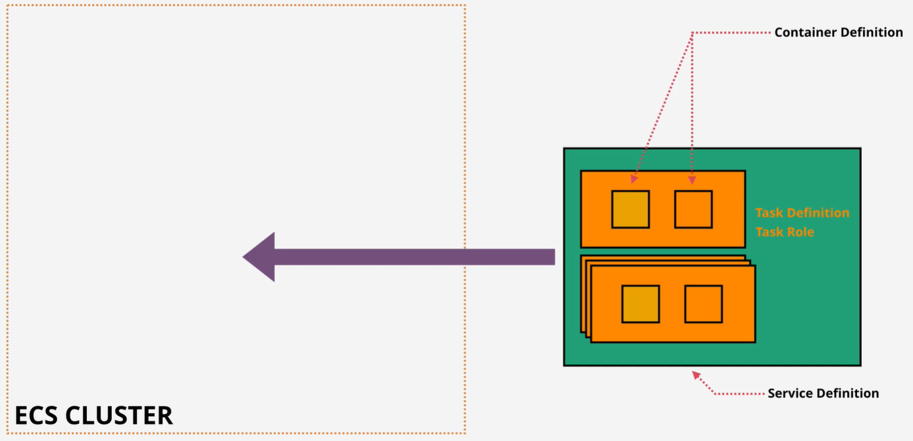

# AWS knowledge
## IAM
### User

  
Summary

   
  
  + There's the 5000 IAM user limit per account.

### Group

  
Summary

   
  
  + Group are not a true identity.
  + Group just container which contains Users.
  + A resource policy cannot grant acess to an group.

### Role

  
Summary

   

  + Can't log in to a Role.
  + Role has two types of policy which can be attach: _Trust Policy_ and _Permissions Policy_.

## Organization
### Service Control Policies

  
Summary

   
  
  + Service Control Policies (SCPs) are just a boundary. They define the limit of what is and isn't allowed
  + The management account is special and it's unaffected by any service control policies.
  + They don't grant any permissions.
  + The default of SCPs is FullAWSAccess.

## CloudTrail

  
Summary

   
  
  + Enable by default on AWS account, but it's only the 90-day event history.
  + Don't get any storage in S3 unless configure a trail.
  + Store management events only by default.
  + IAM, STS, CloudFront log their data as global service events at US East 1 and trail will need to be enable to capure that data.
  + Not real-time.

## Amazon Elastic Compute Cloud (EC2)

  
What is AWS EC2

   
  

## Amazon Virtual Private Cloud (VPC)

  
What is AWS VPC

   
  

## Amazon Elastic Container Service (ECS)

  
What is AWS ECS

   

  ECS is the AWS Docker container service that handles the orchestration and provisioning of Docker containers.

  
ECS terminology

   

  + **Task Definition -** A blueprint that describes how a Docker container should launch. It contains settings like exposed port, docker image, cpu shares, memory requirement, command to run and environmental variables.
  + **Task -** It can be thought of as an “instance” of a _**Task Definition**_. A task can include one or more _containers_.
  + **Container Definition -** A task definition is essentially a blueprint for your application. It describes how one or more containers should be launched within a cluster
  + **Service -** A service manage the lifecycle of tasks, ensuring that the desired number of tasks are always running. It brings resilience and scalability to our tasks.
  + **Cluster -** A logic group of _**EC2**_ instances. _(fagate or ec2 mode)_
  + **Container Instance -** This is just an _**EC2**_ instance that is part of an _**ECS Cluster**_ and has docker and the ecs-agent running on it.
  
  

### Cluster

  
EC2 Mode

   

  

  With EC2 mode, ECS cluster is created within a VPC inside you AWS account. EC2 instances are used to run containers. When you create the cluster you specify an initial size which controls the number EC2 insatances. And you need to worry about capacity and availability for you cluster. So if you want to use containers in your infastructure but you absolutelt need to manage the container host capacity and availability then EC2 mode is for you.

  
Fargate Mode

   

  

  Core of the Farget architecture is a shared Farget infrastrucure platform. You gain access to resources fram shared pool, but you have no visibility of other customers. With Fargate, you use the same task and service definition, these are then allocated to the shared Fargate platform.

  
Fargate vs EC2 Mode

   
  
  **When to use EC2:**
  + When you have existing EC2 hardware that you want to leverage.
  + When you need more control over the underlying instances, such as choosing specific instance types or optimizing for network or GPU performance.
  + For complex microservices architectures.
  + If you have specific compliance or security requirements.

  **When to use Fargate:**
  + If you prefer not to manage the underlying infrastructure and want AWS to handle it.
  + Application with unpredictable or variable workloads, as it can scale up and down automatically.
  + When you need to deploy quickly without worrying about the infrastructure setup.
  + Suitable for short-lived tasks.

  
EC2 vs ECS

   

## Amazon Elastic Container Registry (ECR)

  
What is AWS ECR

   
  Amazon Elastic Container Registry (ECR) is a fully managed container registry service that makes it easy for developers to store, manage, and deploy Docker container images. Each AWS account has a public and private registry, and inside eache registry can have many repositories (like Git or Github). And inside each repository you can have many container images.

  + Public registry - mean that anyone can have _read-only_ access but _read-write_ requires permissions.
  + Private registry - mean that permissions are required for any _read-write_ operations.

  
Benefits

   

## Amazon Simple Storage Service (S3)

  
What is AWS S3

   
  S3 is an object storage service provided by AWS. It offers industry-leading scalability, data availability, security, and performance.
  

  
Buckets and Objects

   
  
  

### Data Management

  
Versioning

   
  
  

  
Object Lock

   
  
  

### Security

  
Bucket Policies

   
  
  

  
Access Control Lists (ACLs)

   
  
  

  
Encryption

   
  
  

### Performance

  
High-Performance Storage

   
  
  

## AWS Lambda
## Gateway

  
What is AWS Gateway

   

